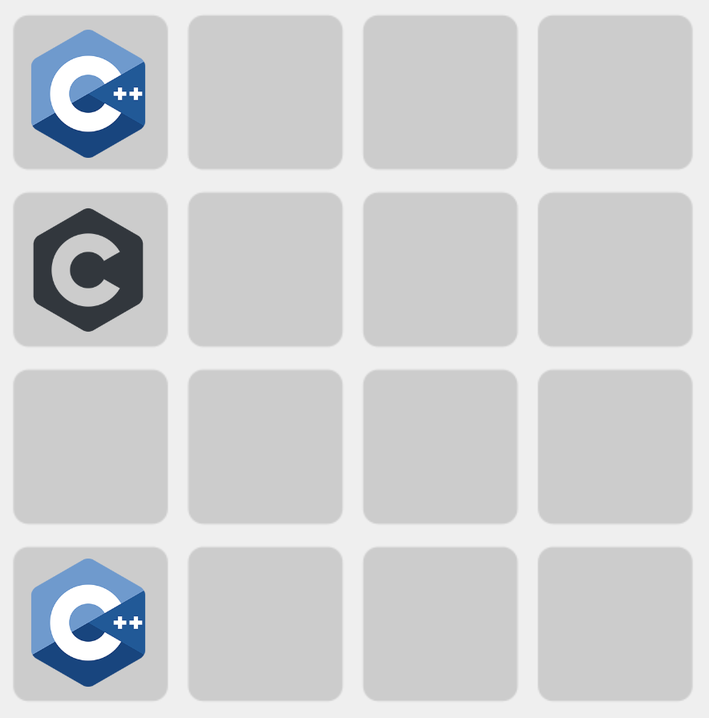
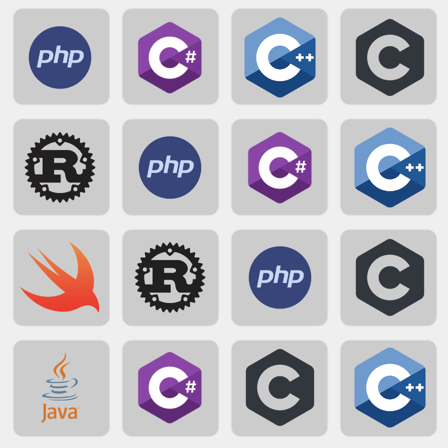

# Get Javascript!
A remake of the popular game 2048, in which the objective is to get Javascript! The game features a 4x4 grid, in which C or C++ will spawn after each move. Then, you can move the blocks and combine them if they are the same language! Reach the Javascript language to win.

## To Play
Simply visit the webpage [here](https://vivaansinghvi07.github.io/get-javascript/).

## Features
- Controllability with WASD or the arrow keys
- A reset button to reset the game
- Win and loss detection
- Smooth animations for block movement and combining
- Checks for board change to spawn a piece

## Example
The board can look like this at the start:

And this at the end:
